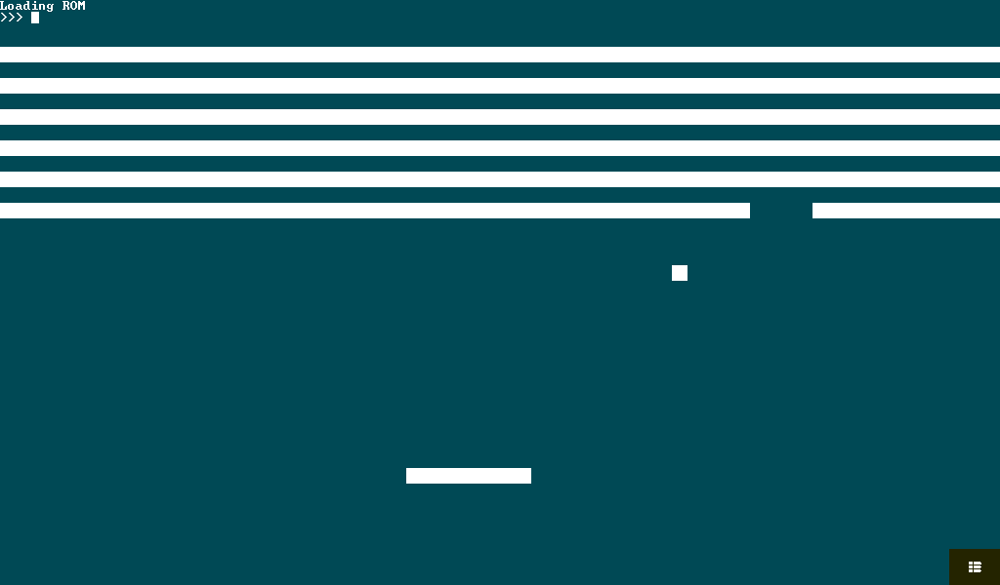
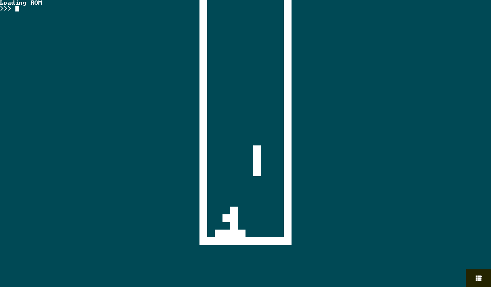
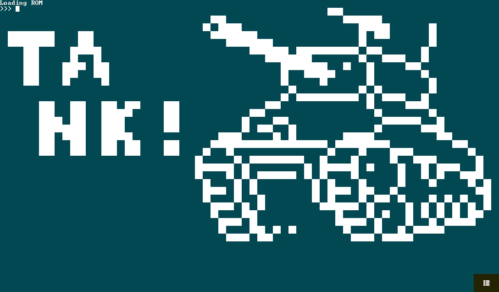
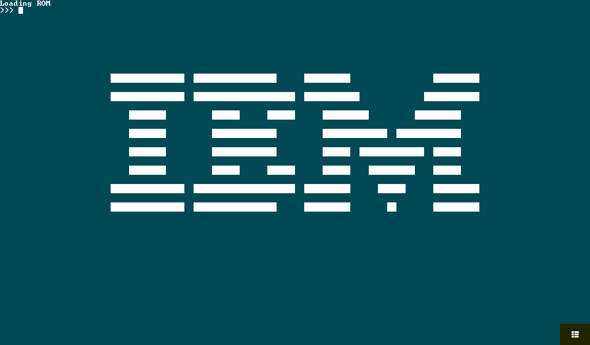
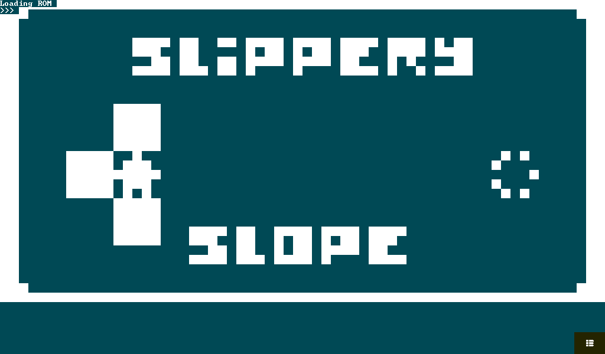

# Tulip8

CHIP-8 Interepreter / Emulator for Tulip Creative Computer

<!--  -->

<div align="center">
  <div style="display: inline-block; margin: 10px;">
    
  </div>
  <div style="display: inline-block; margin: 10px;">
    
  </div>
  <div style="display: inline-block; margin: 10px;">
    
  </div>
  <div style="display: inline-block; margin: 10px;">
    
  </div>
  <div style="display: inline-block; margin: 10px;">
    
  </div>
</div>


## Essentials

Set up a Tulip Desktop environment via the the instructions for the following project:
https://github.com/shorepine/tulipcc

Install SDL2

```sh
# Ubuntu etc
sudo apt install libsdl2-dev libffi-dev

# Fedora etc
sudo dnf install SDL2-devel libffi-devel

# Arch
sudo pacman -S sdl2 libffi
```

<br />

Build and Run Tulip Desktop

```sh
git clone https://github.com/shorepine/tulipcc.git
cd tulipcc/tulip/linux

# Build Tulip Desktop (installs to ~/.local/share/tulipcc)
./build.sh

# Run Tulip Desktop
./dev/tulip
```

## Get Tulip 8

```bash
# Navigate to Tulip Desktop default user directory
cd ~/.local/share/tulipcc/user

# Get Tulip8
git clone https://github.com/stewlab/tulip8.git
git -C tulip8 submodule update --init
```

## Start Tulip Desktop

```sh
# start Tulip Desktop
cd <tulipcc_project_dir>/tulip/linux
./dev/tulip
```

## Run Tulip 8

> note: Run this in Tulip Desktop or another Tulip CC environment

```python
# Be sure you are in ~/.local/share/tulipcc/user (or /user if on an actual device)
cd("<host_user_home_dir>/.local/tulipcc/user")

# Run Tulip8 w/ default program
run('tulip8')

# Run a custom CHIP-8 program custom
# 1. edit tulip8/tulip8.py, and change the following line to point to your custom .ch8 file
program_path = "slipperyslope.ch8"
# 2. save the file, and run tulip8 again
```

## Chip-8 Keymap

**Chip-8** uses a hexadecimal keypad layout. Here's a visual representation:

> Note: `Esc` exits the app

```
**User Keyboard**
1 2 3 4
Q W E R
A S D F
Z X C V
```

maps to

```
**Chip-8 Keyboard**
1 2 3 C
4 5 6 D
7 8 9 A
0 B F E
```

## Info

This is designed so that you can use `chip8.py` in pretty much any Python Frontend application.
It just needs to be constructed with methods to draw pixels, and play/stop a beep/tone

```python
# Chip8 class constructor from chip8.py
 def __init__(
        self,
        screen_width,
        screen_height,
        draw_pixel_callback=None,
        play_audio_callback=None,
    ):
```

- Working features
  - keyboard input
  - audio
  - graphics
  - loading external .ch8 files

- Needs work
  - speed / optimization
  - key_up implementation
